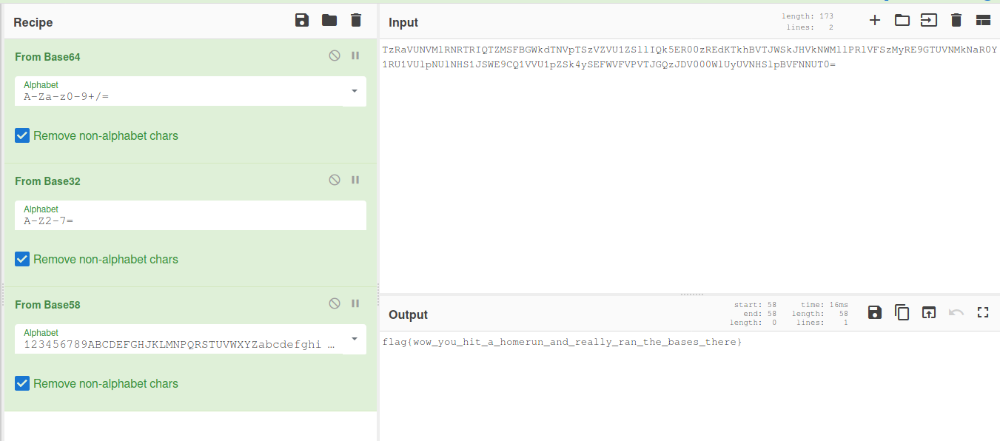

# Baseball

The downloaded file contains some encoded text.

> TzRaVUNVMlRNRTRIQTZMSFBGWkdTNVpTSzVZVU1ZSllIQk5ER00zREdKTkhBVTJWSkJHVkNWMllPRlVFSzMyRE9GTUVNMkNaR0Y1RU1VUlpNUlNHS1JSWE9CQ1VVU1pZSk4ySEFWVFVPVTJGQzJDV000WlUyUVNHSlpBVFNNUT0=

You can manually check for all the hashes but I would recommend using [CyberChef](https://cyberchef.kaltenhauser.rocks/)
This process can be guesswork if you aren't familiar with a lot of alghorithms but if you are familiar with them this won't take very long.

The following chain of alghorithms will lead you to the flag:
- Base64
- Base32
- Base58

Here's a screenshot of how that would look in CyberChef.

And here's the flag

**flag{wow_you_hit_a_homerun_and_really_ran_the_bases_there}**