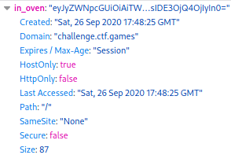
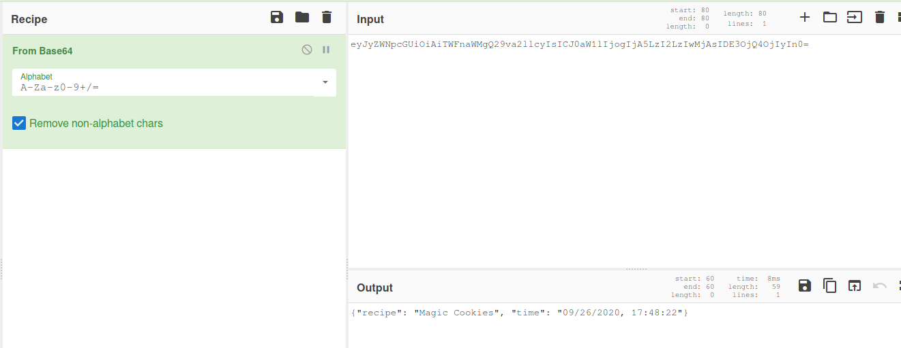
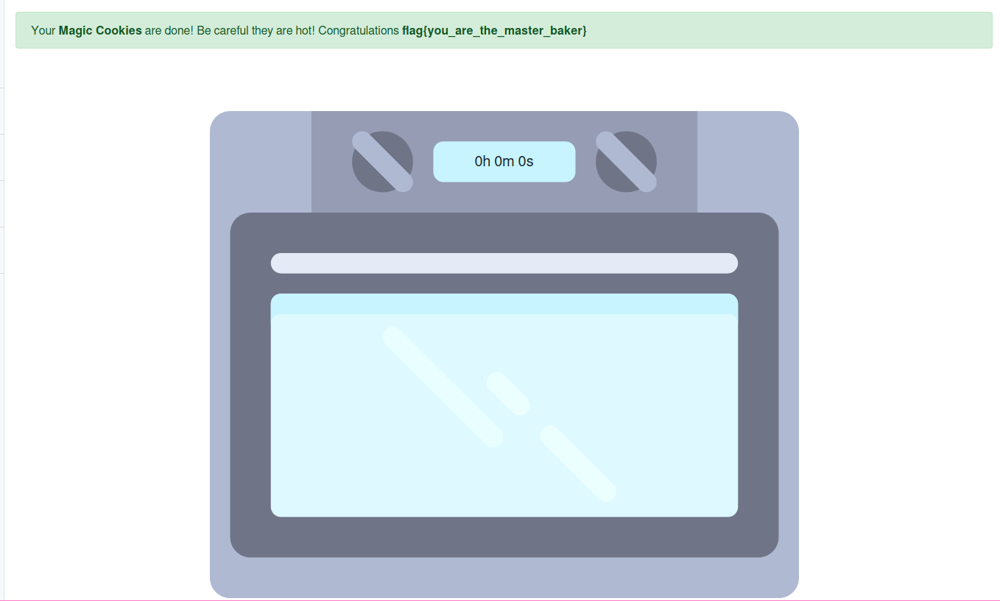

# EZ Bake Oven

First thing that immediately takes my interest is the Magic Cookie which will take 7200 minutes to make, we don't have time for that so let's speed it up.
After doing a quick check trough the source code I found a /cook endpoint which required a recipe, if we don't find anything else we could try to send our own data to this.

But first let's check if there are any sessions/cookies on the site, and guess what there's one called "in_oven".

This session was encoded in base64, upon decoding I was able to find a timestamp of when I started baking the Magic Cookies.

7200 minutes is equal to 5 days so we can modify the timestamp to 5 days in the past, now we can encode it back in base64.
We can now change the value of the in_oven session with the new base65 encoded string.

Now refresh your page and you should be able to see the flag.

**flag{you_are_the_master_baker}**

