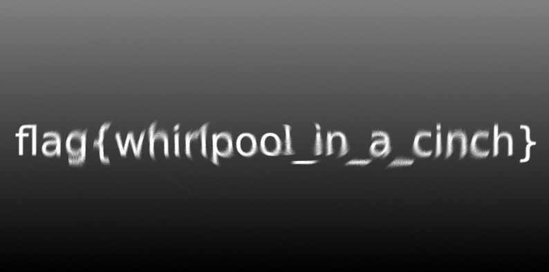

# Kiddie Pool

This is a short one, you get a weird looking image showing a spiral.

My first idea was to try some stego tools like steghide, stegextract and stegcrack but none of those work on pngs.
After this I tried to find some bad clusters using pngcheck but everything seemed fine.
That is untill I noticed that the start of the swirl had the text "flag" in it.
I threw this file in photoshop and used the Twirl tool (Filter -> Distort -> Twirl) to find the flag.

**flag{whirlpool_in_a_cinch}**

