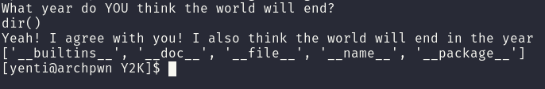
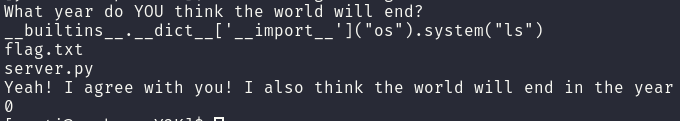

# Y2K

Connecting gives us a question
> What year do YOU think the world will end?

Entering normal numerical input works perfectly fine but entering letters causes the script to crash butr luckily for us we can see that this is a python script due to the error.
I got stuck on this next part for quite a while until I eventually tried some python commands which ended up either giving different errors or giving actual output.
After finding out that we can execute python code I checked the variables of the script hoping to find a "flag" variable, we can do this using locals() and dir().



Now this is where I started to pick up the pace, clearly there had to be some way to get a shell or at least execute commands using this.
I tried a lot of ways to get a shell but none worked, mostly due to being unable to import anything so pty and os were unavailable.
Eventually I found [this source](https://book.hacktricks.xyz/misc/basic-python/bypass-python-sandboxes) which showed a way to exploit the __builtins__ variable.

```python3
__builtins__.__dict__['__import__']("os").system("ls")
```



This showed me a file called flag.txt and I was able to alter the exploit to cat the file giving me the flag.

```python3
__builtins__.__dict__['__import__']("os").system("cat flag.txt")
```

**flag{we_are_saved_from_py2_k}**

